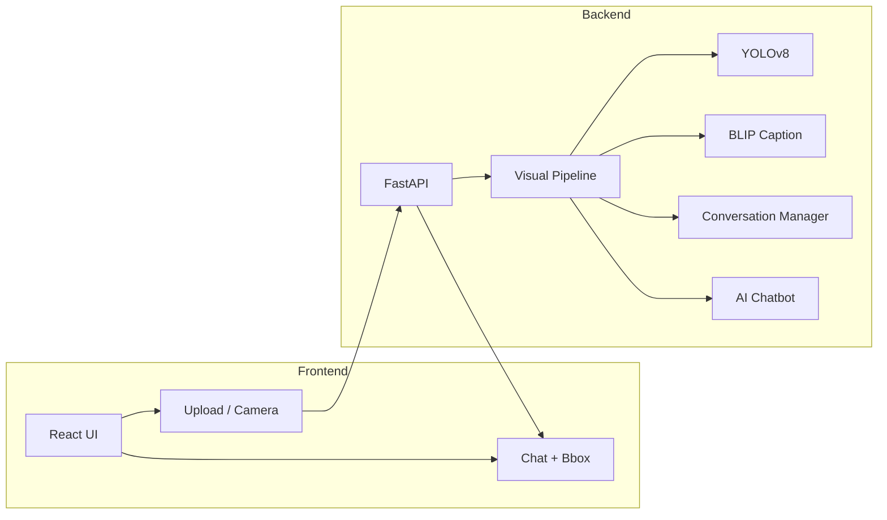

# AI Visual Assistant

**Conversational Image Recognition Chatbot** — upgraded to a production-style **AI Visual Assistant** for Final Year B.Tech (AI). Users upload or capture an image, then ask questions in natural language. The system uses **YOLOv8** for object detection, optional **BLIP** for image captioning, and an **LLM or rule-based** chatbot for answers, with **session-based conversation memory** and a modern React UI.

---

## Features

- **Vision–language pipeline:** YOLOv8 detection → BLIP scene caption → EasyOCR text → spatial relations → AI reasoning (LLM or rule-based)  
- **Detailed object analysis:** Per-object color, position, size (small/medium/large), confidence; relationships (e.g. “person is left of car”)  
- **OCR:** Text in image (e.g. “What is written on the notebook?”) via EasyOCR  
- **Scene understanding:** Full image description and natural-language answers (e.g. “Four students are sitting at desks…”)  
- **Conversation memory:** Follow-up questions via session ID  
- **Upload + camera:** Gallery upload and webcam capture  
- **Visual feedback:** Bounding boxes on image; object stats sidebar  
- **Image Analysis Report:** Collapsible panel with scene, objects, relationships, text, safety warnings  
- **Safety:** Warnings for dangerous objects (knife, gun, etc.)  
- **Question types:** What do you see?, counting, colors, positions, relationships, text, safety, confidence  
- **UI:** Two-column layout, dark/light theme, voice input  
- **Performance:** Async FastAPI, detection caching, optional GPU  

---

## System architecture (high level)



Detailed architecture: [docs/ARCHITECTURE.md](docs/ARCHITECTURE.md).

---

## Tech stack

| Layer    | Technologies |
|----------|--------------|
| Backend  | FastAPI, YOLOv8, OpenCV, BLIP (transformers), EasyOCR, OpenAI-compatible LLM |
| Frontend | React 19, Axios, CSS3 |
| Optional | Ollama / OpenAI for LLM; GPU for YOLO/BLIP |

---

## Project structure

```
Final Year Project/
├── backend/
│   ├── main.py                 # FastAPI app, POST /analyze/, GET /health
│   ├── models/
│   │   ├── yolo_detector.py    # YOLOv8 + bbox, color, position, size, relations
│   │   ├── caption_model.py   # BLIP captioning (optional)
│   │   └── ocr_model.py       # EasyOCR text detection (optional)
│   ├── services/
│   │   ├── visual_reasoning.py      # Pipeline + caching
│   │   └── conversation_manager.py  # Session state + history
│   ├── chatbot/
│   │   └── ai_chatbot.py      # LLM or rule-based answers
│   ├── utils/
│   │   ├── image_utils.py     # Save upload, preprocessing
│   │   └── color_detection.py # RGB → color name
│   ├── requirements.txt
│   ├── yolov8n.pt            # Pre-trained YOLO (or auto-download)
│   └── uploads/
├── frontend/
│   └── src/
│       ├── App.js
│       ├── App.css
│       ├── context/ThemeContext.jsx
│       └── components/
│           ├── CameraCapture.jsx
│           ├── BoundingBoxOverlay.jsx
│           ├── ObjectStatsSidebar.jsx
│           ├── ImageAnalysisReport.jsx
│           └── VoiceInputButton.jsx
├── docs/
│   ├── API.md
│   └── ARCHITECTURE.md
└── README.md
```

---

## Installation

### Prerequisites

- Python 3.10+
- Node.js 16+
- pip, npm

### Backend

```bash
cd backend
python -m venv venv
venv\Scripts\activate          # Windows
# source venv/bin/activate     # macOS/Linux
pip install -r requirements.txt
```

Optional:

- **LLM:** Set `OPENAI_API_KEY` (and optionally `OPENAI_API_BASE`, `LLM_MODEL`). For local Ollama: `OPENAI_API_BASE=http://localhost:11434/v1`.
- **Caption:** BLIP uses `transformers` and `torch` (in requirements). If not installed, caption stays empty.

### Frontend

```bash
cd frontend
npm install
npm start
```

Default frontend: `http://localhost:3000`. Default API: `http://127.0.0.1:8000` (set `REACT_APP_API_URL` if different).

### Run backend

```bash
cd backend
venv\Scripts\activate
uvicorn main:app --reload
```

---

## API

- **GET** `/health` — Health check.
- **POST** `/analyze/` — `multipart/form-data`: `file` (image), `question` (string), optional `session_id`.  
  Returns: `success`, `detected_objects`, `caption`, `answer`, `session_id`.

Full API description: [docs/API.md](docs/API.md).  
Interactive docs: **http://127.0.0.1:8000/docs**.

---

## Usage

1. Open the React app (e.g. `http://localhost:3000`).
2. Upload an image (drag-and-drop or “Upload”) or use “Camera” to capture.
3. Ask a question (e.g. “What objects are here?”, “What color is the car?”, “How many people?”).
4. Use the same image for follow-up questions; the backend keeps context via `session_id`.
5. Toggle theme (header), use voice input (mic icon), or download the text report when available.

---

## Configuration

- **Backend:** Run from `backend/` so that `utils`, `models`, `services`, `chatbot` resolve.
- **LLM:** `OPENAI_API_KEY`, `OPENAI_API_BASE`, `LLM_MODEL`.
- **Frontend API URL:** `REACT_APP_API_URL` (default `http://127.0.0.1:8000`).

---

## Security (production)

- Restrict CORS origins.
- Add authentication/authorization and rate limiting.
- Validate uploads (type, size).
- Do not commit API keys; use environment variables.

---

## License

Educational use — Final Year Project.

---

## Author

Created for B.Tech Final Year Project (AI).  
Upgraded to AI Visual Assistant with hybrid pipeline, conversation memory, camera capture, bounding boxes, and improved UI.
